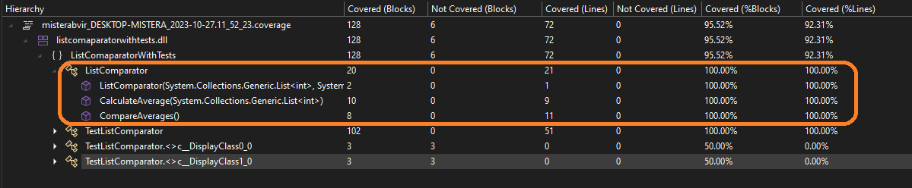

# Описание тестов для класса ListComparator

## Тесты для отрицательных сценариев

### Тест `TestNegativeEmptyList`

Этот тест проверяет, что класс правильно обрабатывает случаи, когда один или оба списка имеют длину, равную нулю. В этом случае, ожидается возникновение исключения `ZeroDivisionError`, так как нельзя вычислить среднее значение для пустого списка.

### Тест `TestNegativeNullList`

Этот тест проверяет, что класс правильно обрабатывает случаи, когда один или оба списка равны null. В этом случае, ожидается возникновение исключения `NullReferenceException`, так как нельзя вычислить среднее значение для не существующего списка.

## Тесты для метода `CompareAverages`

### Тест `TestPositiveFirstListAverageLessThanSecond`

Этот тест проверяет, как метод `CompareAverages` обрабатывает ситуацию, когда средние значения двух списков равны. Ожидается, что метод вернет строку "The average values are equal".

### Тест `TestPositiveFirstListAverageHigherThanSecond`

Этот тест проверяет метод `CompareAverages` в случае, когда среднее значение первого списка выше, чем среднее значение второго списка. Ожидается, что метод вернет строку "The first list has a higher average value".

### Тест `TestPositiveEqualListAverages`

Этот тест проверяет метод `CompareAverages` в случае, когда среднее значение второго списка выше, чем среднее значение первого списка. Ожидается, что метод вернет строку "The second list has a higher average value".

## Покрытие тестами
