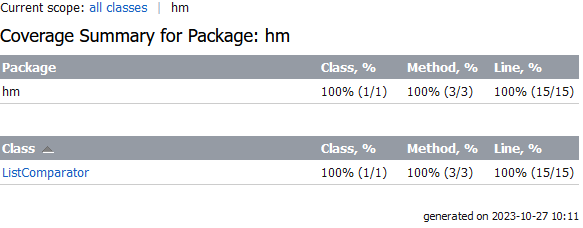

# Описание тестов для класса ListComparator

## Тесты для отрицательных сценариев

### Тест `testNegativeEmptyList`

Этот тест проверяет, что класс правильно обрабатывает случаи, когда один или оба списка имеют длину, равную нулю. В этом случае, ожидается возникновение исключения `ZeroDivisionError`, так как нельзя вычислить среднее значение для пустого списка.

<<<<<<< HEAD
### Тест `testNegativeNullList`

Этот тест проверяет, что класс правильно обрабатывает случаи, когда один или оба списка равны null. В этом случае, ожидается возникновение исключения `NullPointerException`, так как нельзя вычислить среднее значение не существующего списка.

=======
>>>>>>> dc5a0198b2dd8aa7c46f1431e8d4ab98893b3f6e
## Тесты для метода `compareAverages`

### Тест `testPositiveFirstListAverageLessThanSecond`

Этот тест проверяет, как метод `compareAverages` обрабатывает ситуацию, когда средние значения двух списков равны. Ожидается, что метод вернет строку "The average values are equal".

### Тест `testPositiveFirstListAverageHigherThanSecond`

Этот тест проверяет метод `compareAverages` в случае, когда среднее значение первого списка выше, чем среднее значение второго списка. Ожидается, что метод вернет строку "The first list has a higher average value".

### Тест `testPositiveEqualListAverages`

<<<<<<< HEAD
Этот тест проверяет метод `compareAverages` в случае, когда среднее значение второго списка выше, чем среднее значение первого списка. Ожидается, что метод вернет строку "The second list has a higher average value".
=======
Этот тест проверяет метод `compare_averages` в случае, когда среднее значение второго списка выше, чем среднее значение первого списка. Ожидается, что метод вернет строку "The second list has a higher average value".
>>>>>>> dc5a0198b2dd8aa7c46f1431e8d4ab98893b3f6e

## Покрытие тестами
