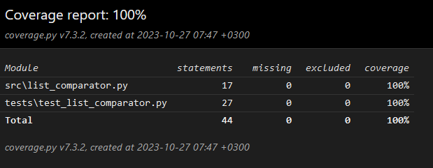

# Описание тестов для класса ListComparator

## Тесты для отрицательных сценариев

### Тест `test_negative_list_lengths`

Этот тест проверяет, что класс правильно обрабатывает случаи, когда один или оба списка имеют длину, равную нулю. В этом случае, ожидается возникновение исключения `ZeroDivisionError`, так как нельзя вычислить среднее значение для пустого списка.

### Тест `test_non_numeric_elements`

Этот тест проверяет, как класс обрабатывает случаи, когда один или оба списка содержат нечисловые элементы. Ожидается возникновение исключения `TypeError`, так как среднее значение может быть вычислено только для числовых данных.

## Тесты для метода `compare_averages`

### Тест `test_compare_averages_with_empty_lists`

Этот тест проверяет метод `compare_averages` в случае, когда оба входных списка пусты. Ожидается, что метод выбросит исключение `ZeroDivisionError`, так как нельзя сравнивать средние значения пустых списков.

### Тест `test_compare_averages_with_equal_averages`

Этот тест проверяет, как метод `compare_averages` обрабатывает ситуацию, когда средние значения двух списков равны. Ожидается, что метод вернет строку "The average values are equal".

### Тест `test_compare_averages_with_first_list_higher_average`

Этот тест проверяет метод `compare_averages` в случае, когда среднее значение первого списка выше, чем среднее значение второго списка. Ожидается, что метод вернет строку "The first list has a higher average value".

### Тест `test_compare_averages_with_second_list_higher_average`

Этот тест проверяет метод `compare_averages` в случае, когда среднее значение второго списка выше, чем среднее значение первого списка. Ожидается, что метод вернет строку "The second list has a higher average value".

## Покрытие тестами

